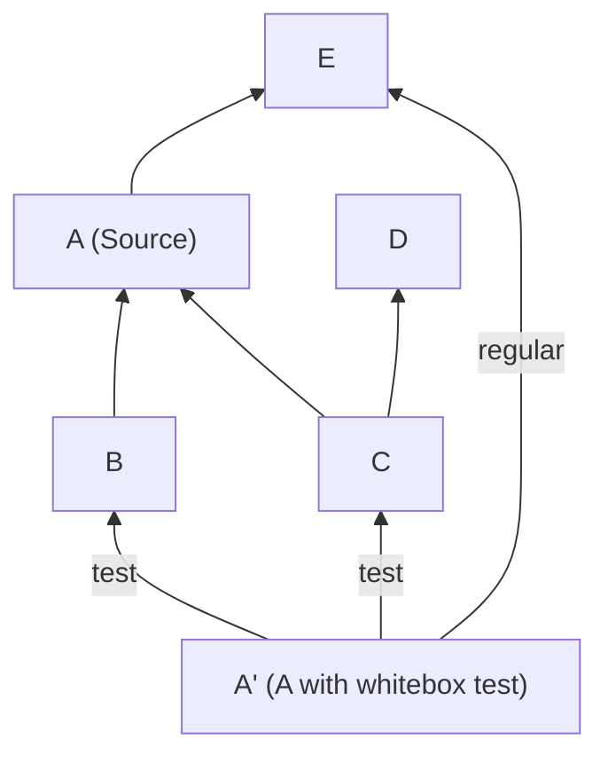
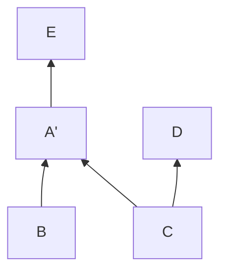

# How a MoonBit package is built

## Anatomy of a package

There are a lot of knobs to tweak within a package,
but we will focus on those related to how it is compiled in this section.
This section assumes a non-virtual package.

### Source files

There are 4 kinds of source files within each package:

- **Source**. These are the regular `.mbt` files within a package.
  All files in the current package with `.mbt` extension
  and does not to any below belong to this kind.
- **Whitebox test**. These files are suffixed `_wbtest.mbt`.
- **Blackbox test**. These files are suffixed `_test.mbt`.
- **C stub**. These are C files manually specified in each package,
  and recognized by the build system to be built.

### Build targets

Source files may also be conditionally included into the build --
see [Conditional Compilation](./cond-comp.md) for more information.

There are 4 major build targets within each package,
each with its own list of source files (and thus acting like a package):

| Build target      | Source | Whitebox | Blackbox | C stub | Enable test | Note                          |
| ----------------- | ------ | -------- | -------- | ------ | ----------- | ----------------------------- |
| **Source**        | ☑️     |          |          | ☑️     | no          | The package itself            |
| **Inline test**   | ☑️     |          |          | ☑️     | yes         | Tests written in source files |
| **Whitebox test** | ☑️     | ☑️       |          | ☑️     | yes         | Sees private defs in source   |
| **Blackbox test** |        |          | ☑️       |        | yes         | Depend on Source              |

### Imports

The imported packages are specified in the `imports` field in `moon.mod.json`,
and are available to all three build targets.
Test targets (whitebox and blackbox) can also have imports that are not used in regular targets,
specified in an additional import field named `wbtest-import` and `test-import`.

### Build results

Building a compile unit results mainly in 3 files:

- **`.mi` / Interface file**:
  This is the binary representation of the public interface of the package.
  When importing a package from another, this file is imported.
- **`.core` / Core IR**:
  This is the intermediate representation this package compiles to.
  A later step will compile convert it into the resulting binary.
- **`.mbti` / Text Interface**:
  This file is a textural representation of `.mi`.
  It is used for users to ensure compatibility of the public API of the package.
  It is also used as an input for virtual packages.
  This file is usually promoted back to the source directory.

## Build Actions

For each build target, there are a numbers of actions that can be triggered:

### Check

- Generates: `.mi`
- Depends on: `.mi` of dependencies
- Via: `moonc check` (See `gen_check_command`)

### Build

- Generates: `.mi`, `.core`
- Depends on: `.mi` of dependencies
- Via: `moonc build` (See `gen_build_command`)

### Build C stubs

- Generates: C object files
- Depends on: (nothing)
- Via: C compiler configured by system or user

### Link Core

- Generates: Compilation output (js/wasm/c/object)
- Depends on: `.core` of all dependencies
- Via: `moonc link-core` (See `gen_link_command`)

### Make executable

(No-op on platforms where `link-core` already outputs the final executable)

- Generates: Executable file
- Depends on: link-core; Build C stubs of all dependencies
- Via: native C compiler and/or linker

### Generate MBTI

- Generates: MBTI
- Depends on: `.mi` of package itself
- Via: `mooninfo`

## Top-level actions

These actions are performed directly according to user action.

### `moon check`

This action checks all packages within the current module,
and output warnings/errors if any failed.

- Depends on:
  - _Check_ (with all warnings ignored) of outside dependency packages
  - _Check_ of all (or specified) packages within the current module

### `moon build`

This action builds the executable of the package.

- Depends on:
  - If the module has packages to be linked (executable, WASM library, etc.)
    - _Make executable_ of all packages that needs linking
  - Otherwise:
    - _Build_ and _Build C stubs_ of all (or specified) packages within the module

### `moon run`

Runs the specific executable.

- Depends on:
  - Same as `moon build` of the package.
- Executes:
  - The built executable.

### `moon test`

Runs test throughout the module.

- Depends on:
  - _Build_ of _Source_, _Whitebox test_ and _Blackbox test_ of all packages within the project
    (or specified package) with tests enabled. (Inline tests)
- Executes:
  - All built executables, with test information passed through the preferred method of the platform.

### `moon bundle`

Bundles all `.core` files into one `.core` to be used.
Only used in the standard library `moonbitlang/core`.

- Depends on:
  - _Build_ of all _Source_ of packages within the module.
- Executes:
  - `moonc bundle-core`

## Solving import loops

### ... in whitebox tests

Whitebox tests are the more special kind of test within them.
While source is just source code itself,
and blackbox test is just another package depending on the source files,
whitebox tests can see private definitions within the source files.

This requirement, in reality,
is implemented with whitebox tests compiling _with_ the regular source files,
so it takes no further effort to reveal private defs.
This whitebox-aided test _replaces_ the original package's position within the original graph.

There _might_ be import loops between whitebox tests and its test dependencies,
as we can already seen in `moonbitlang/core`.
(More practically, it's `A(whitebox) -> B -> A(source)`,
so it's technically not a loop.
However, only one version of each package can be linked into the final executable,
so you will encounter a loop when linking.)
Such "loop"s should be accepted.

Practically, you may continue using the regular build graph
with source and test targets separated.
When performing _Link-core_ of whitebox tests (no action is needed in other stages),
replace the source node in the topo-sorted import list with the whitebox one.
No other actions should be needed.

#### Example

The following is an example build graph generated for whitebox test of A,
written as A', with whitebox and regular build separated into different nodes:

It should be topo-sorted when performing _Link-core_ as if it was:

An example resulting sort is: E, A', B, D, C.
