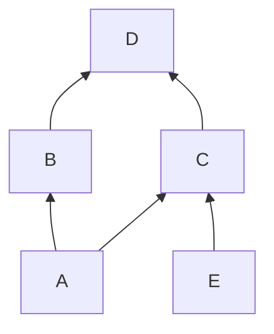
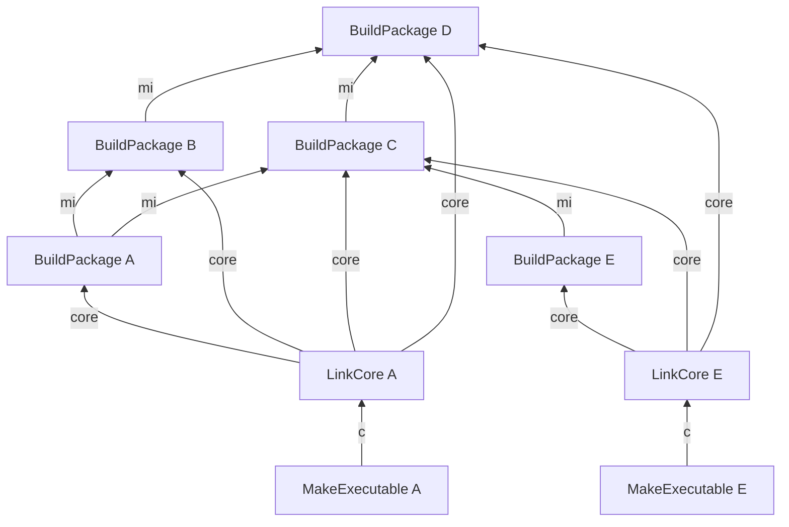
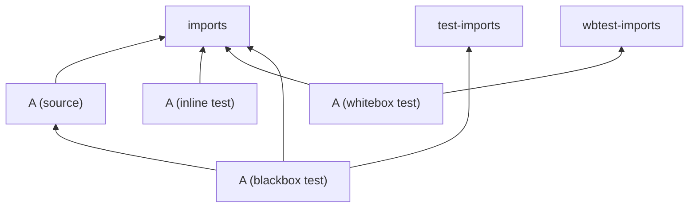
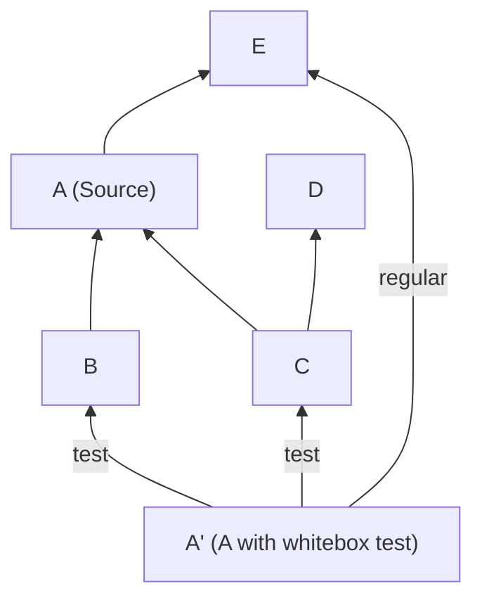
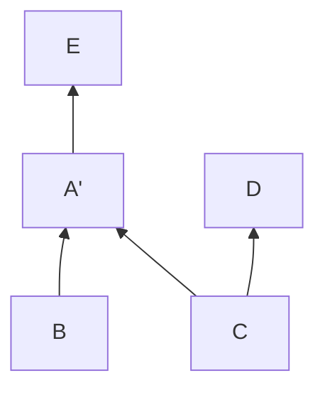

# How a MoonBit package is built

> This document reflects the state of the repository around 2025.12.
> Please use the actual implementation as the ultimate source of truth.

This documentation describes how each package is built.
For the overview of the architecture, pipeline and vocabulary, see [Architecture](./arch.md).

## Anatomy of a package

There are a lot of knobs to tweak within a package,
but we will focus on those related to how it is compiled in this section.

This document assumes non-virtual packages.
For virtual packages, see [Virtual Packages](./virtual-pkg.md).

### Source files

There are 4 kinds of source files within each package:

- **Source**. These are the regular `.mbt` files within a package.
  All files in the current package with `.mbt` extension
  and does not to any below belong to this kind.
- **Whitebox test**. These files are suffixed `_wbtest.mbt`.
- **Blackbox test**. These files are suffixed `_test.mbt`.
- **C stub**. These are C files manually specified in `moon.pkg.json`,
  and recognized by the build system to be built.

### Build targets

Source files may also be conditionally included into the build --
see [Conditional Compilation](./cond-comp.md) for more information.

There are 4 build targets (see [Architecture][])[^subpkg] for each package,
each with its own list of source files (and thus acting like an actual "package" to build with):

| Build target kind | Source | Whitebox | Blackbox | C stub | Enable test | Note               |
| ----------------- | ------ | -------- | -------- | ------ | ----------- | ------------------ |
| **Source**        | ☑️     |          |          | ☑️     | no          | The package itself |
| **Inline test**   | ☑️     |          |          | ☑️     | yes         |                    |
| **Whitebox test** | ☑️     | ☑️       |          | ☑️     | yes         |                    |
| **Blackbox test** |        |          | ☑️       |        | yes         |                    |

The detailed semantics of tests are in [the corresponding section](#building-tests).

[^subpkg]: There's a 5th one, "subpackage", which is currently unused. We'll ignore it for now.

[architecture]: ./arch.md

### Imports

The imported packages are specified in the `imports` field in `moon.mod.json`,
and are available to all three build targets.
Test targets (whitebox and blackbox) can also have imports that are not used in regular targets,
specified in an additional import field named `wbtest-import` and `test-import`.

## Build pipeline

There are two build commands that are used to build the source files,
both working on the source code of a **single** package (more precisely, a build target).

- **`moonc build-package` (build plan node `BuildPackage`)**
  is _the_ command used to compile source file.
  It reads the interface files of dependency packages,
  and compiles the source code of a package into
  an intermediate representation called CoreIR, and the package interface file
  (see [below](#build-package-outputs) for details about file types).
- **`moonc check` (build plan node `Check`)**
  is used for typecheck source files without compiling.
  It only outputs the package interface, not the CoreIR.

When actually building a package, the pipeline has 2 or 3 steps depending on the backend to use:

1. **Build** each individual package, via `moonc build-package` / `BuildPackage` node, into CoreIR.
2. **Link** into executable, via `moonc link-core` / `LinkCore` node.
   This step reads in all CoreIR files produced by the package and all its transitive dependencies,
   and links into an executable output.
   For JS/WASM backends, this already outputs the final executable.
3. **Make native executable**, via C compiler / `MakeExecutable` node.
   For native (Native/LLVM) backends,
   the output of `LinkCore` (C or object file) is compile/link by a C compiler,
   together with C stubs and other build outputs,
   to produce the final executable.
   Non-native backends do not need this step.

A package needs all its transitive dependencies' interface files to be built
before running `BuildPackage` for any of its build targets.
In the build plan, this means each `BuildPackage` node depends only on:

- the interface files (`.mi`) of its direct dependency build targets
  (the build graph executor tracks transitive dependencies), and
- any toolchain/backend preparation nodes.

There are no other hidden cross-package dependencies.
Once those prerequisites are satisfied,
each build target's `BuildPackage` node can be scheduled in any order
or in parallel with other `BuildPackage` nodes.

### Build-package outputs

The `BuildPackage` node produces two main output files.

- **`.core` / CoreIR**:
  This is the intermediate representation the code in this package compiles to.
- **`.mi` / Interface file**:
  This is the binary representation of the public interface of the package.
  This file is passed to the compiler when other packages import this package.

### Link-core outputs

The `LinkCore` node produces a single backend-specific compilation output,
containing all compiled MoonBit code for the package to build:

- For JS, WASM and WASM-GC backend,
  this is the final executable to use: A JavaScript or WASM file.
- The Native backend outputs a C file to be compiled with a C compiler.
- The LLVM backend outputs an object file to be linked with the system library.

### Example

Assume we have a dependency graph as following (edge point from one item to its dependency):

If we're building the executable for A and E, the build plan will look like:

The edges still point from dependents to dependencies.
The text on the edge represent the files needed between nodes.
As you may be able to see, `BuildPackage` of C and D s shared between the two builds.

## Extra tasks

### C stubs

MoonBit allows native-backend programs to compile some C files alongside MoonBit code,
called **C stubs**.
These files are per-package, specified in `moon.pkg.json`.
MoonBit code might reference the functions defined in them in e.g. `extern "C" fn`s.

Compiling C stubs of a package involves 3 steps:

1. `BuildCStub` -- The C files are compiled independently using a C compiler.
   They do not have any dependency on their own.
2. `ArchiveOrLinkCStubs` -- All C stubs in a package is archived using AR.
   If [TCC-run mode](./tcc-run.md) is enabled, this instead links the C stubs.
   This is out of scope of a regular compilation.
3. For every package that transitively depends on this package with C stubs,
   the archived compilation output is added to the input list of `MakeExecutable`.

### Reading and writing MBTI interfaces

**A `.mbti` file** is the textural representation of `.mi`.
It is used for users to ensure compatibility of the public API of the package,
as well as the input of virtual packages' interfaces.
(See virtual package info in [Virtual packages](./virtual-pkg.md)).

A `.mbti` file can be losslessly transform to and from a `.mi` file
given the package configuration (mainly, the import list for it to resolve imports).
Two build plan nodes are responsible for this:

- `GenerateMbti`, via `mooninfo`, converts a `.mi` file to `.mbti` file.
- `BuildVirtual`, via `moonc build-interface`, converts a `.mbti` file to `.mi` file.

### Prebuild tasks

MoonBit allows some files in the source directory to be generated at compile time.
These are called **prebuild tasks**,
and executed in a form similar to Makefiles.
Each task may have a list of input and outputs file, and a command line to execute.
It is represented by the `RunPrebuild` build plan node.

For simplicity reasons, the dependency between prebuild tasks and other tasks
is currently tracked by the build graph executor (n2), and not in the build plan.
This is currently the only exception in the build plan graph.

Prebuild tasks are expected to execute before any other build commands.

## Building tests

There are three types of tests in a MoonBit package.
In detail:

- **Inline tests** are tests written alongside the source code.
  They don't get their own imports.

- **Whitebox tests** are tests written in files suffixed with `_wbtest`.
  These tests are compiled alongside the source code,
  and can see the package-private symbols in the source code.
  They get additional imports from the `wbtest-imports` in package config.

- **Blackbox tests** are tests written in files suffixed with `_test`,
  as well as in the doc comments in the source code.
  These tests can only see the public symbols exported from the package.
  They get additional imports from the `test-imports` in package config.

  Implementation-wise, they form a package that depend on the source package,
  but gets special treatments to be able to import symbols in the source package
  without qualification.

All three test targets are compiled to an executable in the corresponding backend.

The different build targets have the following dependency relationship:

### Generating test driver

To run tests, one must first know what _are_ the tests to run.
In MoonBit, this is done by scanning the source code for tests,
and then generate a test driver and related metadata.

- The **test driver** is a MoonBit source file
  containing the mapping between test identifiers and the test blocks (test functions),
  and the entry point to tests.
- The **test metadata** is a JSON file containing metadata of the test cases.
  It is used by `moon` itself to get the list of tests,
  and determine the tests to run based on user request.

Both files are generated per-build-target via `moon generate-test-driver` (`GenerateTestInfo`).
The driver is used in `BuildPackage` like a regular source file.

## Glossary of major build plan nodes

The following is a table

| Build plan node                 | Command                     | Outputs               | Dependencies                               | Note                                           |
| ------------------------------- | --------------------------- | --------------------- | ------------------------------------------ | ---------------------------------------------- |
| `Check(BuildTarget)`            | `moonc check`               | `.mi`                 | source files, `.mi` of dependency packages | Typecheck the target                           |
| `BuildPackage(BuildTarget)`     | `moonc build-package`       | `.mi`, `.core`        | same as above                              | Build the target                               |
| `LinkCore(BuildTarget)`         | `moonc link-core`           | backend-specific      | `.core` of all transitive deps             | Links all transitive deps into output          |
| `MakeExecutable(BuildTarget)`   | C compiler                  | executable            | `LinkCore` outputs, C stubs                | Compiles/links the final executable (optional) |
| `BuildCStub(PackageId, int)`    | C compiler                  | object file           | N/A                                        | Builds a single C stub file                    |
| `ArchiveOrLinkCStub(PackageId)` | C compiler                  | archive file          | `BuildCStub` outputs                       | Collect C stub output                          |
| `GenerateMbti(BuildTarget)`     | `mooninfo`                  | `.mbti`               | `.mi`                                      | Get text repr of `.mi`                         |
| `GenerateTestInfo(BuildTarget)` | `moon generate-test-driver` | test driver, metadata | source files                               | Generate the test driver and metadata          |
| `BuildVirtual(PackageId)`       | `moonc build-interface`     | `.mi`                 | `.mbti`                                    | Get interface from `.mbti`                     |
| `RunPrebuild(PackageId, int)`   | User-defined                | user-defined          | user-defined                               | Run a user-defined prebuild task               |

## Solving import loops

### ... in whitebox tests

Whitebox tests are the more special kind of test within them.
While source is just source code itself,
and blackbox test is just another package depending on the source files,
whitebox tests can see private definitions within the source files.

This requirement, in reality,
is implemented with whitebox tests compiling _with_ the regular source files,
so it takes no further effort to reveal private defs.
This whitebox-aided test _replaces_ the original package's position within the original graph.

There _might_ be import loops between whitebox tests and its test dependencies,
as we can already seen in `moonbitlang/core`.
(More practically, it's `A(whitebox) -> B -> A(source)`,
so it's technically not a loop.
However, only one version of each package can be linked into the final executable,
so you will encounter a loop when linking.)
Such "loop"s should be accepted.

Practically, you may continue using the regular build graph
with source and test targets separated.
When performing _Link-core_ of whitebox tests (no action is needed in other stages),
replace the source node in the topo-sorted import list with the whitebox one.
No other actions should be needed.

#### Example

The following is an example build graph generated for whitebox test of A,
written as A', with whitebox and regular build separated into different nodes:

It should be topo-sorted when performing _Link-core_ as if it was:

An example resulting sort is: E, A', B, D, C.
