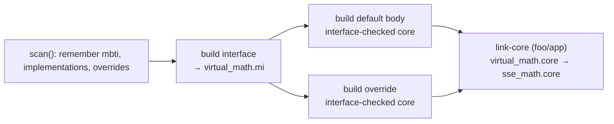

# Virtual Packages

Virtual packages publish an overridable API surface. The build system handles them by recognising virtual contracts early, generating interfaces before compiling any body, validating those bodies against the contracts, and substituting the chosen implementation when linking. The sections below describe that behaviour; the code links at the end of each section show how Moon implements it today.

## Discovery and metadata

During the scan phase, Moon records virtual metadata alongside the rest of the package description:

- Each `moon.pkg.json` is parsed.
- If a package declares `virtual_pkg`, the referenced `.mbti` file is checked and its location stored so later stages can compile the interface. The `.mbti` file is either: `pkg.mbti` (new) or `<package_short_name>.mbti` (old).
- Packages with `implement = "<virtual>"` are tagged as implementations of that virtual package.
- Any package that lists `overrides` gets a consumer-local mapping `<virtual> → <implementation>`.

Doing this during the scan phase ensures every build mode sees a consistent view of virtual contracts, their implementations, and any consumer-specific overrides.
See [`scan::scan_one_package()`](crates/moonutil/src/scan.rs:311).

## Build pipeline

The build stage adds three behaviours on top of what regular packages already do:

1. **Compile the interface first.** The scanner chooses the `.mbti` file referenced in `virtual_pkg.interface`. Build compiles that file and pulls in the `.mi` files of any imports, producing the contract other packages must satisfy.
   See [`gen_build::gen_build_interface_item()`](crates/moonbuild/src/gen/gen_build.rs:98) and [`gen_build::gen_build_interface_command()`](crates/moonbuild/src/gen/gen_build.rs:369).

2. **Validate the default body (if any).** When `virtual_pkg.has_default` is true, Moon compiles the bundled body right after the interface and checks that the resulting `.core` stays compatible with the interface before exposing it.
   See [`gen_build::gen_build_command()`](crates/moonbuild/src/gen/gen_build.rs:440).

3. **Validate concrete implementations.** Packages that implement the virtual are compiled with the same compatibility checks and they reuse the virtual package’s `.mi` instead of emitting another one.
   See [`gen_build::gen_build_build_item()`](crates/moonbuild/src/gen/gen_build.rs:195).

As long as interface compilation happens first and every body passes those checks, the dependency graph can treat virtual packages like ordinary ones: their `.mi` products feed downstream builds, and consumers will never see an out-of-date interface.

## Overrides at link time

When linking, any consumer that listed overrides swaps the virtual `.core` out for its chosen implementation. The `.core` list is rewritten just before `moonc link-core` runs so the implementation’s artifact replaces the virtual one while keeping the rest of the dependency set intact.

During traversal this also redirects the walk: once a virtual node is matched with an implementation, Moon descends through the implementation’s own dependency graph instead of the virtual package’s. Each package is still compiled separately—an implementation’s `.core` only contains its own code—so its dependencies appear as their own cores under their usual package paths and are linked exactly as any other dependency would be. The substitution remains local to the consumer that requested it.

If a virtual package ships no default body, the build simply errors: dependency traversal stops with “virtual package … has no implementation” if no override is provided, so the failure happens before any link step runs.

See [`gen_build::replace_virtual_pkg_core_with_impl_pkg_core()`](crates/moonbuild/src/gen/gen_build.rs:270) and [`gen::util::topo_from_node()`](crates/moonbuild/src/gen/util.rs:50).

## Consistency across build, check, and test

The same behaviour repeats in every build mode:

- **Check** mode regenerates interfaces, reruns default validation with `-check-mi`, and enforces `-check-mi/-impl-virtual` for implementations so diagnostics match the normal build.
  See [`gen_check::gen_check()`](crates/moonbuild/src/gen/gen_check.rs:452).

- **Test** mode builds test drivers on top of the same interface/implementation pipeline, then applies overrides before generating runnable artefacts.
  See [`gen_runtest::gen_runtest()`](crates/moonbuild/src/gen/gen_runtest.rs:966).

Test-only packages that implement a virtual package go through the same validation: their compiled artefacts are checked against the virtual interface before any test harness links them in, so mismatched implementations fail during the test build stage rather than at runtime. Black-box tests do not re-run that check; they import the already-validated package core instead of recompiling it.

## How virtual packages differ from regular packages

| Capability              | Regular package                                           | Virtual package                                                                  |
| ----------------------- | --------------------------------------------------------- | -------------------------------------------------------------------------------- |
| Interface emission      | `.mi` comes from `moonc build-package` alongside `.core`. | `moonc build-interface` emits `.mi` before any bodies compile.                   |
| Default implementation  | Not applicable.                                           | Optional body compiled with `-check-mi pkg.mi -no-mi`.                           |
| Implementations         | No special handling.                                      | Compiled with `-check-mi virtual.mi -impl-virtual -no-mi`.                       |
| Overrides               | Imports resolve to the declared package.                  | Consumer rewrites the virtual `.core` to its chosen implementation at link time. |
| Build/check/test parity | Single pipeline.                                          | Same validation logic repeated for every mode.                                   |

## End-to-end example

The following flow shows a virtual package `foo/virtual_math`, its bundled default, and an overriding implementation `bar/sse_math` used by an application:

Command summary:

| Step                    | Command (schematic)                                                             | Purpose                                                               |
| ----------------------- | ------------------------------------------------------------------------------- | --------------------------------------------------------------------- |
| Interface               | `moonc build-interface foo/virtual_math/virtual_math.mbti -o …/virtual_math.mi` | Emit the contract used for validation.                                |
| Default body (optional) | `moonc build-package … -check-mi …/virtual_math.mi -no-mi`                      | Keep the default aligned with the contract.                           |
| Implementation          | `moonc build-package … -check-mi …/virtual_math.mi -impl-virtual -no-mi`        | Ensure each override matches the same contract.                       |
| Link                    | `moonc link-core …`                                                             | Substitute the consumer’s chosen `.core` in place of the virtual one. |

Following these behaviours guarantees that every implementation satisfies the same interface and that overrides never leak beyond the package that asked for them.
