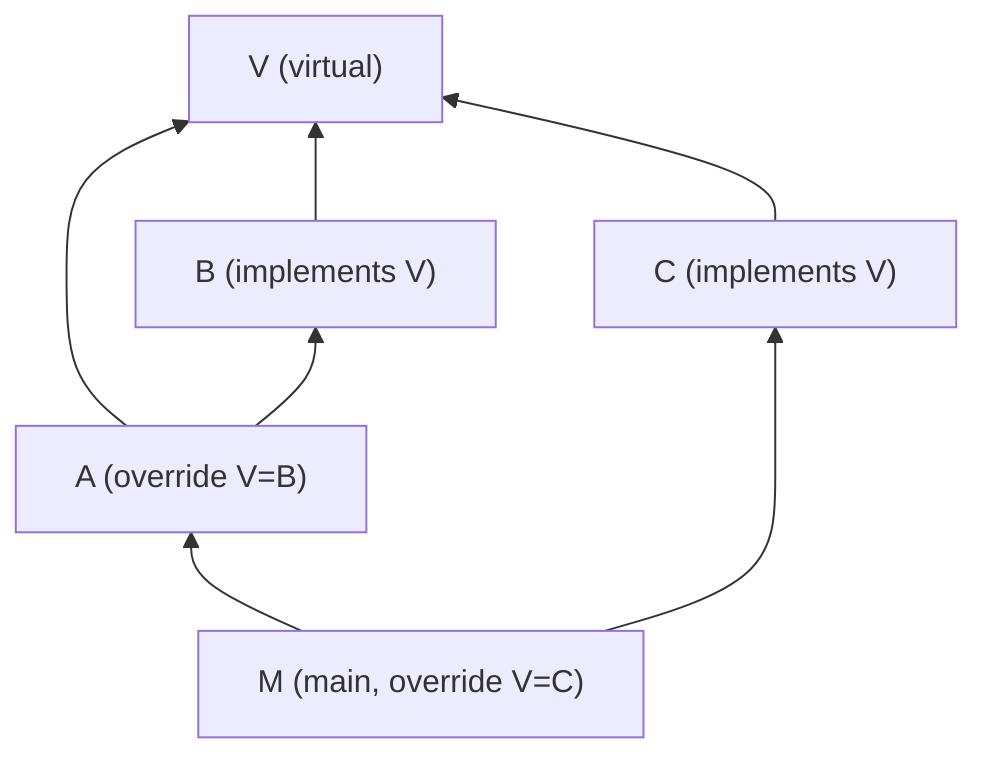

# Virtual Packages

Virtual packages allow the same set of library functions to be overridden.
This section mainly talks about how virtual packages are implemented.

A virtual package is built from its `.mbti` interface file,
located within its source directory.
The _Build interface_ action (below) will be executed to get its `.mi` interface.

The virtual package might or might not have a default implementation located in the same directory.
If it does, it can also be built like a regular package;
otherwise, it only has a `.mi` interface and does not have a `.core`.

## Overriding a virtual package

On any package, the virtual package can be overridden with a package that implements it.
**The override only has effect on the package itself, not its dependants.**
For example, for the following package dependency graph,
main package `M` will see virtual package `V` overridden by `C`,
and if the overriding line is removed it will not be able to build at all.

This means that overriding a virtual package on another package that does not build into an executable
will have no effects other than in its own tests.

## Build interface

This is an additional action that only works on virtual packages.

- Generates: `.mi` interface
- Depends on: `.mbti` interface
- Via: `moon build-interface` (see `gen_build_interface_command`)
